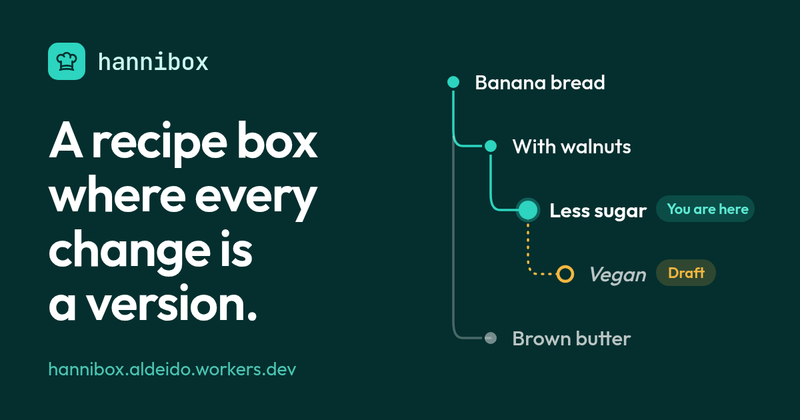
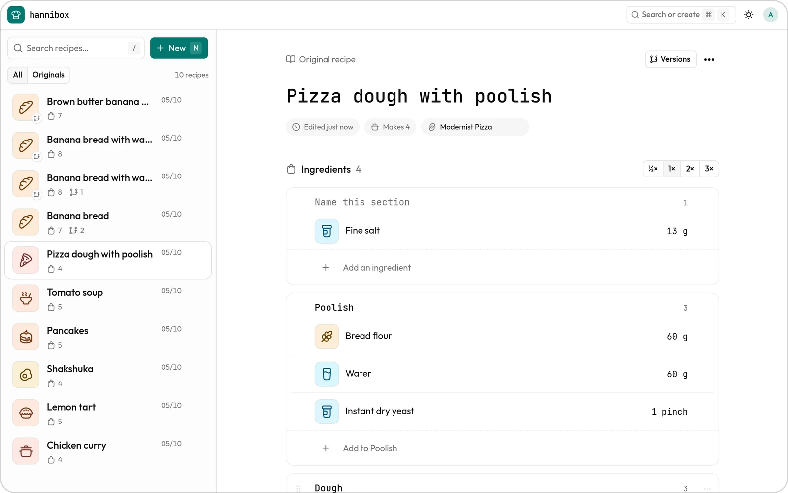
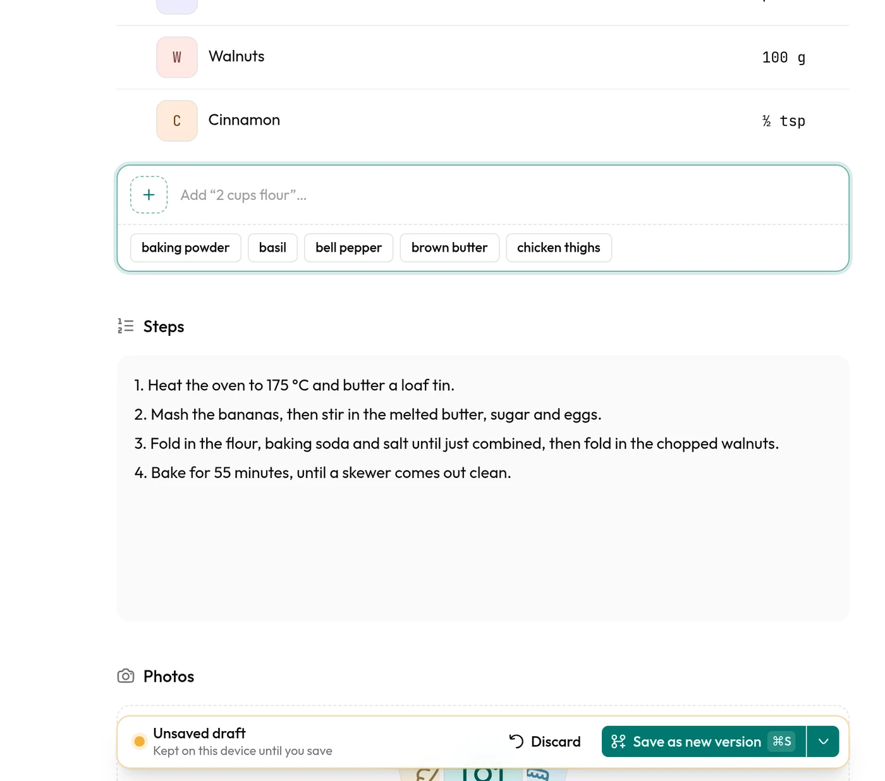
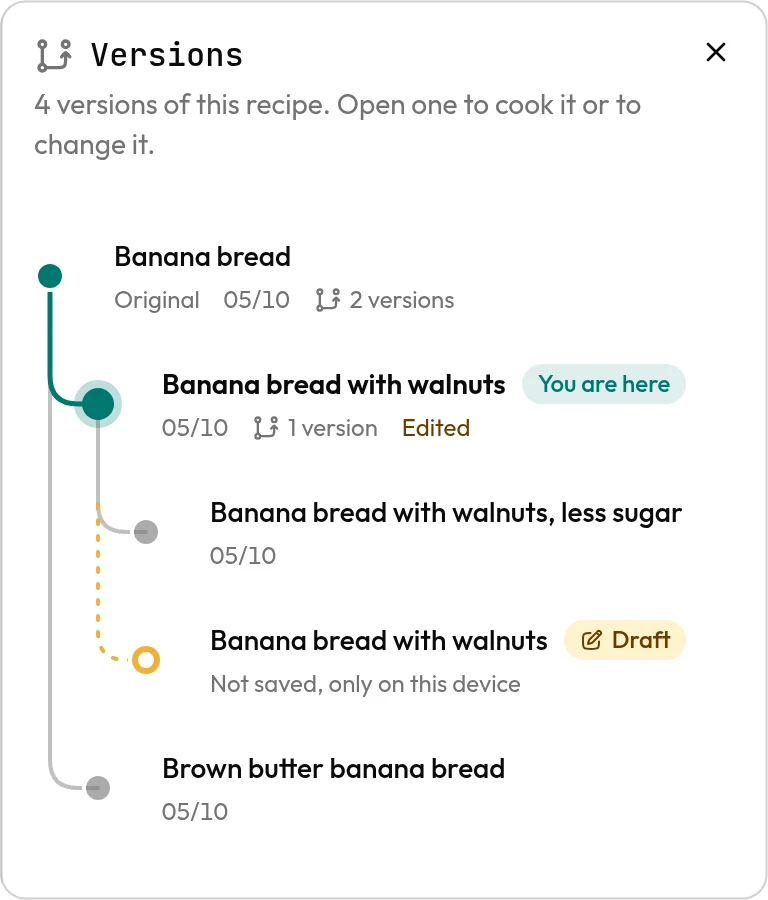
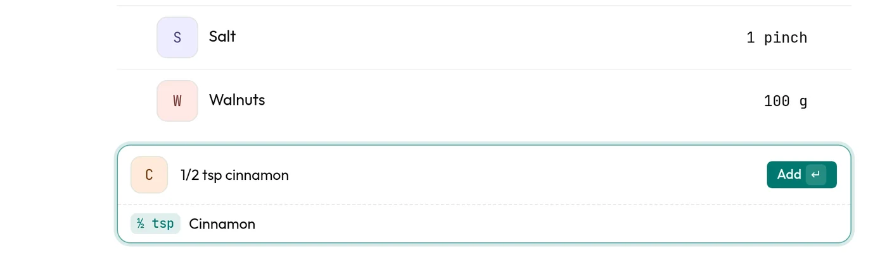
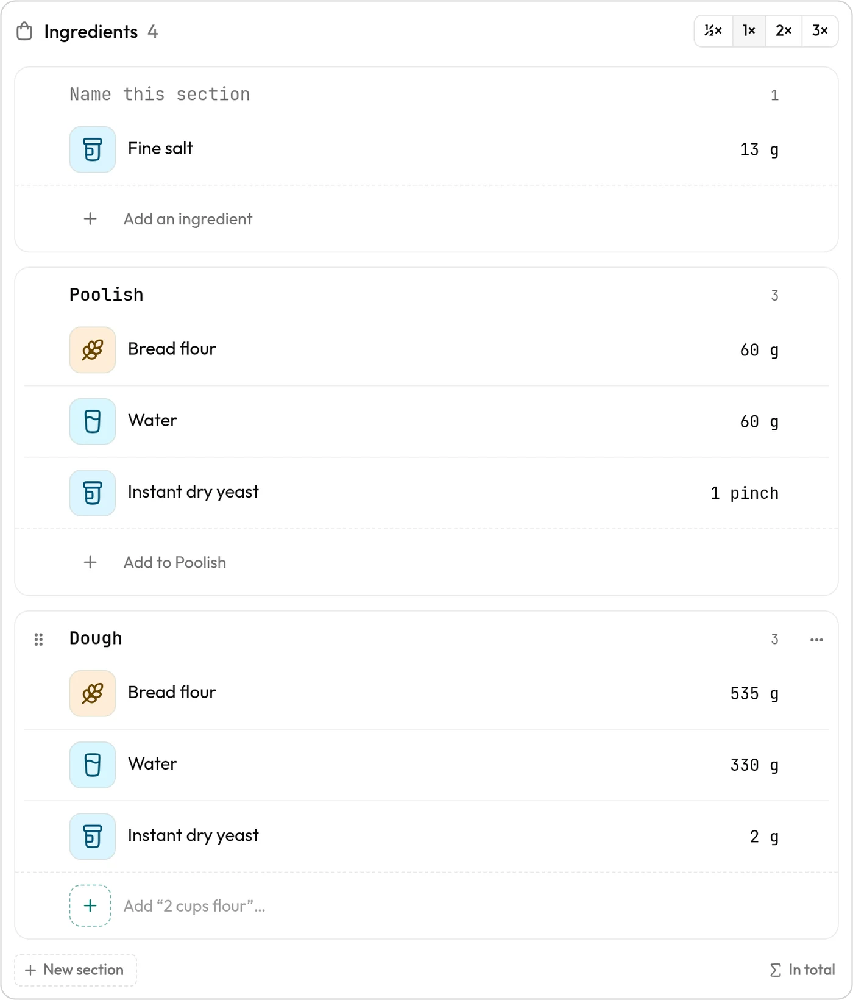
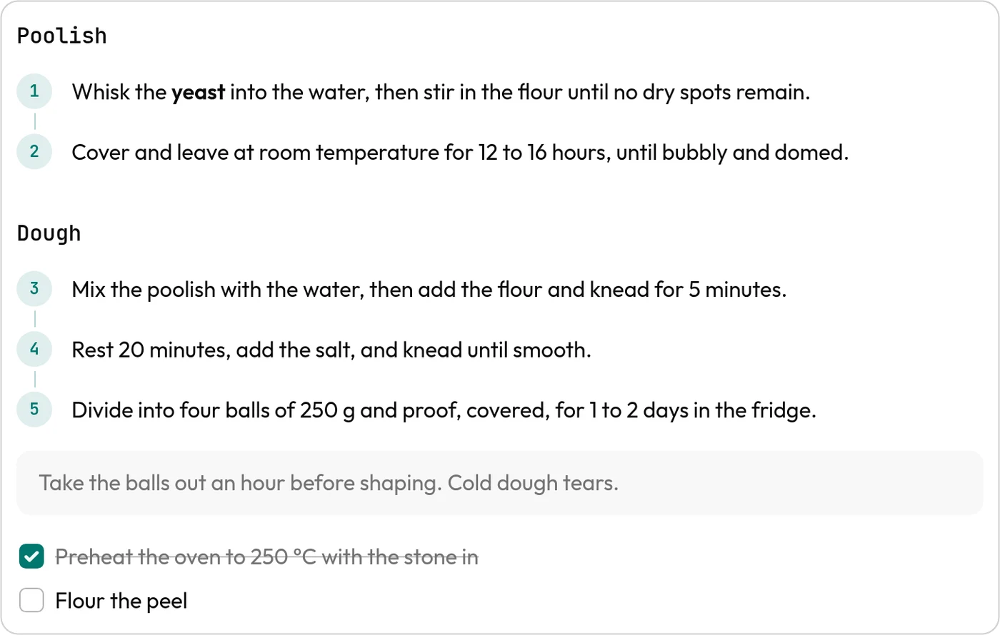
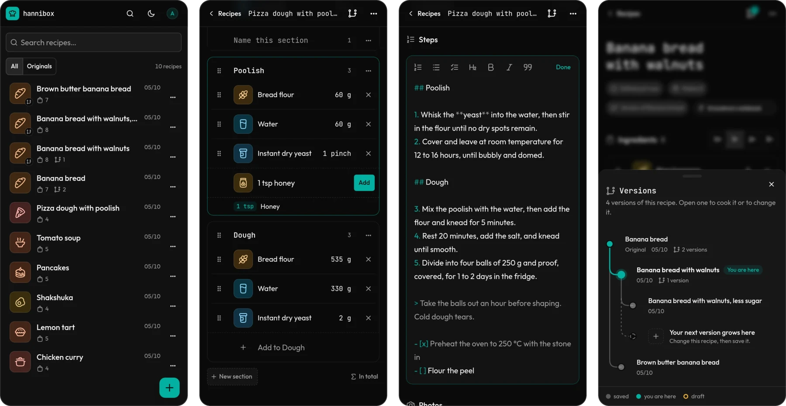

<div align="center">


# hannibox

**A recipe box where every change is a version.**

[hannibox.aldeido.workers.dev](https://hannibox.aldeido.workers.dev)

<br />



</div>

<br />

## The idea

You bake your grandmother's banana bread. Next time you add walnuts. A week later you cut the sugar, then you try browning the butter. Every change felt like an improvement, and now you can't say what the original tasted like, or which change made it better.

hannibox keeps all of it. **A recipe is a tree.** The original is the root, and each change you save becomes a new version under the one you started from. Nothing is overwritten unless you ask for it.

<div align="center">
<picture>
  <source media="(prefers-color-scheme: dark)" srcset="docs/images/workspace-dark.webp" />
  
</picture>
<br />
<sub>Your recipes on the left, the one you are cooking on the right.</sub>
</div>

<br />

## Change a recipe without fear

Open any recipe and edit it. **Nothing reaches the server while you do.** What you change is a draft that stays on your device, photos included, and it survives a reload. A bar at the bottom says so and gives you two ways out: discard the draft, or save it.

<div align="center">

<br />
<sub>The draft lives on this device until you decide.</sub>
</div>

<br />

## Save it as a version

Saving makes a **new recipe under the one you opened**, with the ingredients and photos you kept. The original stays as it was. The versions panel draws the tree, lights the path from the original to where you are, and shows your draft as a dashed node.

Overwriting is there for fixing a typo in place, and its menu tells you when it would delete a photo.

<div align="center">

<br />
<sub>Every version keeps its place. The dashed one is not saved yet.</sub>
</div>

<br />

## Write ingredients the way you say them

Type _1/2 tsp cinnamon_ and hannibox reads an amount, a unit and a name, and shows what it understood before you add it. Ingredients are shared between recipes, so the field suggests the ones you already use. The ½×, 1×, 2× and 3× buttons **scale the amounts you see** without changing what is saved.

<div align="center">

<br />
<sub>Half a teaspoon of cinnamon, read before it goes in.</sub>
</div>

<br />

## Recipes made in parts

A pizza dough has a poolish and a dough. A cake has a batter and a frosting. Type a line that ends in a colon, like _Dough:_, and **what you add next goes under that heading**. The same ingredient can appear in two sections, flour in the poolish and flour in the dough, and _In total_ adds it up for the shopping list.

<div align="center">

<br />
<sub>Each section is a card, and each card ends where you add to it.</sub>
</div>

<br />

## Steps that read like a recipe

Steps are **Markdown**, drawn for reading. Numbered steps get a circle and a line down to the next one, headings split the recipe into parts, and tips and checklists have their own look. Tap anywhere on the text to edit it right there, with a toolbar for the marks and Enter continuing your list.

<div align="center">

<br />
<sub>Headings, numbered steps, a tip and a checklist, from plain text.</sub>
</div>

<br />

## Made for the counter

hannibox is **built for a phone propped against the flour tin**. The list and the recipe take turns on a narrow screen, buttons grow on touch screens, toasts come up where your thumb already is, and there is a dark theme for the late bake. Drag the handle to reorder ingredients, move one to another section, or move a whole section.

<div align="center">

<br />
<sub>The list, a section being added to, the steps editor, and the versions.</sub>
</div>

<br />

## Stack

<div align="center">

|         |                                                            |
| ------- | ---------------------------------------------------------- |
| Web     | React Router as a SPA, TanStack Query, Tailwind, shadcn/ui |
| API     | Hono on Cloudflare Workers                                 |
| Data    | D1 with Drizzle, Better Auth for email and password        |
| Tooling | Bun workspaces, Oxlint, Oxfmt, Lefthook                    |

</div>

The API and the SPA ship as **one Worker**. It answers `/api/*` and serves the built SPA as static assets. A push to `main` deploys it through Workers Builds, which applies the D1 migrations before it publishes.

## Run it

You need [Bun](https://bun.sh).

```sh
bun install
cp apps/api/.dev.vars.example apps/api/.dev.vars   # then fill in BETTER_AUTH_SECRET
bun run dev
```

Open http://localhost:5173. `bun run dev` applies the migrations to a local D1 first.

How the repo is laid out, the API routes and the database workflow are in [CONTRIBUTING.md](CONTRIBUTING.md). The tables are drawn in [packages/db/schema.md](packages/db/schema.md).
