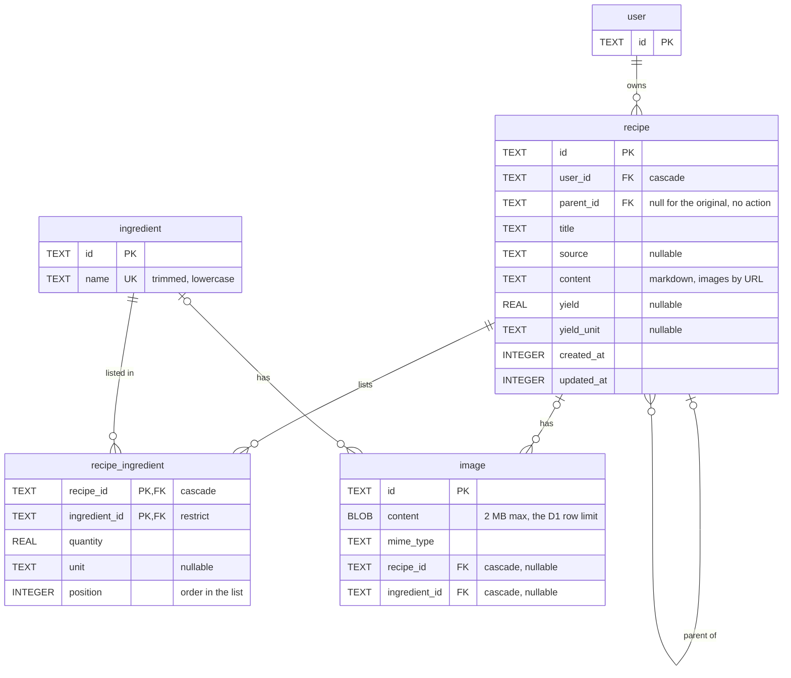

# Schema

The recipe tables, drawn before they are written in Drizzle. `user` comes from Better Auth (see `src/auth.ts`) and is shown only as the owner.

## Rules

- **Recipe tree.** A variation points at the recipe it came from through `parent_id`. The original is `WHERE parent_id IS NULL`, and a whole tree is one recursive CTE. Deleting a recipe that still has variations is refused, so the app moves or deletes them first. The key is `no action`, not `restrict`: restrict fires row by row and would also block the cascade that deletes a user's whole tree. A variation belongs to the same user as its parent; the app enforces that, not the database.
- **Units.** One list, `UNITS` in `packages/shared/src/units.ts`: `g kg ml L cup glass tbsp tsp pinch`. It types `recipe.yield_unit` and `recipe_ingredient.unit`, and zod checks it at the API. There is no `CHECK` in the database, because changing one means rebuilding the table, and a rebuild with cascading keys is risky on D1. A null unit counts things: "2 eggs".
- **Ingredients are shared.** One catalog for every user, with a unique name, which the app stores trimmed and lowercase because SQLite folds case for ASCII only ("Óleo" would not match "óleo"). The amount and the unit live on `recipe_ingredient`, so the same flour can be grams in one recipe and cups in another. The same ingredient appears once per recipe, and `position` keeps the order the list was written in.
- **Images.** An image belongs to exactly one recipe or one ingredient: `CHECK ((recipe_id IS NULL) <> (ingredient_id IS NULL))`. `mime_type` is there so the API can serve the bytes. The recipe `content` references an image by its URL. Never select `content` in a list or a `with`, since it is the bytes: serve it from its own route. The schema lets an ingredient have several images, but the API keeps one photo and replaces it.
- **Ids and timestamps.** Text ids made by the app (`crypto.randomUUID()`), because D1 has no interactive transaction: a recipe and its ingredients go in one `db.batch`, so the ids must exist before the insert. Timestamps are millisecond integers, like the Better Auth tables.
- **Indexes.** `recipe(parent_id)`, `recipe(user_id, updated_at)` for the list, `recipe_ingredient(ingredient_id)`, `image(recipe_id)`, `image(ingredient_id)`.

## Open

- Who may change the photo of a shared ingredient. Today any user can, because the catalog has no owner. The API offers no way to rename or delete an ingredient.

## Out of scope

Ingredient suppliers, unit conversions and ingredient substitutions.
