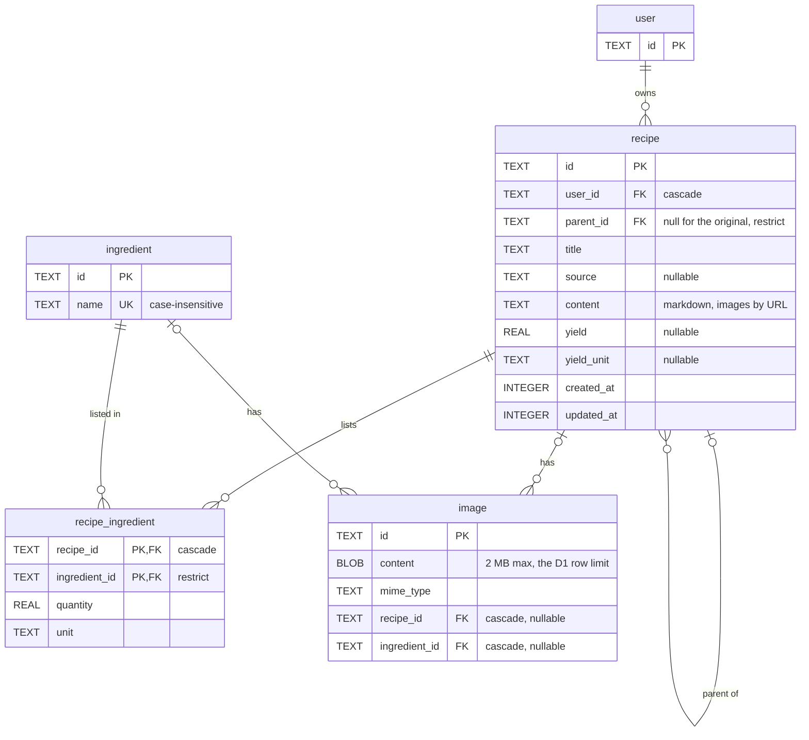

# Schema

The recipe tables, drawn before they are written in Drizzle. `user` comes from Better Auth (see `src/schema.ts`) and is shown only as the owner.

## Rules

- **Recipe tree.** A variation points at the recipe it came from through `parent_id`. The original is `WHERE parent_id IS NULL`, and a whole tree is one recursive CTE. Deleting a recipe that still has variations is refused (`restrict`), so the app moves or deletes them first. A variation belongs to the same user as its parent; the app enforces that, not the database.
- **Units.** One list, `g | L | copo | uni`, used by `recipe.yield_unit` and `recipe_ingredient.unit`. Stored as `TEXT` with a `CHECK`. `uni` is not in the sketch, but the recipe screen shows "2 uni Farinha".
- **Ingredients are shared.** One catalog for every user, with a unique name. The amount and the unit live on `recipe_ingredient`, so the same flour can be grams in one recipe and cups in another. The same ingredient appears once per recipe.
- **Images.** An image belongs to exactly one recipe or one ingredient: `CHECK ((recipe_id IS NULL) <> (ingredient_id IS NULL))`. `mime_type` is there so the API can serve the bytes. The recipe `content` references an image by its URL.
- **Ids and timestamps.** Text ids (UUIDs made by the app) and millisecond integer timestamps, like the Better Auth tables.
- **Indexes.** `recipe(parent_id)`, `recipe(user_id, updated_at)` for the list, `recipe_ingredient(ingredient_id)`, `image(recipe_id)`, `image(ingredient_id)`.

## Open

- Who may rename, delete or change the photo of a shared ingredient. Today any user can, because the catalog has no owner.
- Order of the ingredients inside a recipe. There is no `position` column, so the list follows insertion order.

## Out of scope

Ingredient suppliers, unit conversions and ingredient substitutions.
